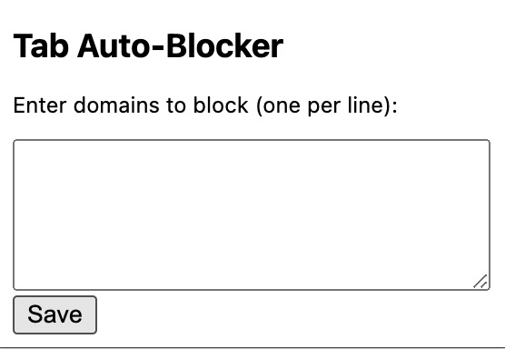

# Tab Auto-Blocker 🚀

This Chrome extension automatically blocks and closes tabs that open unwanted websites. Users can customise the block list to fit their needs 🌐🛑

## Features ✨

- Instantly closes tabs that match a user-defined block list.
- Works for manual and automatic redirects.
- Lightweight and runs in the background. 🚀

## Blocked Domains 🚫

This extension **does not** include any default blocked domains. Users must add their own block list.

## Installation 📥

1. Download or clone the repository.
2. Open `chrome://extensions/` in Chrome.
3. Enable **Developer Mode**.
4. Click **Load unpacked** and select the folder.

## Updating the Block List 🔄

To add or remove websites from the block list:

1. Click the extension icon in Chrome.

  

2. Enter domains to block (one per line).
3. Click **Save**.
4. The extension will start blocking those sites immediately.

## Testing ✅

Try opening a site from your block list—it should close immediately. 🚀❌

## Uninstalling ❌

Go to `chrome://extensions/`, find the extension, and click **Remove**.

## License 📜

Free to use, modify, and distribute.
